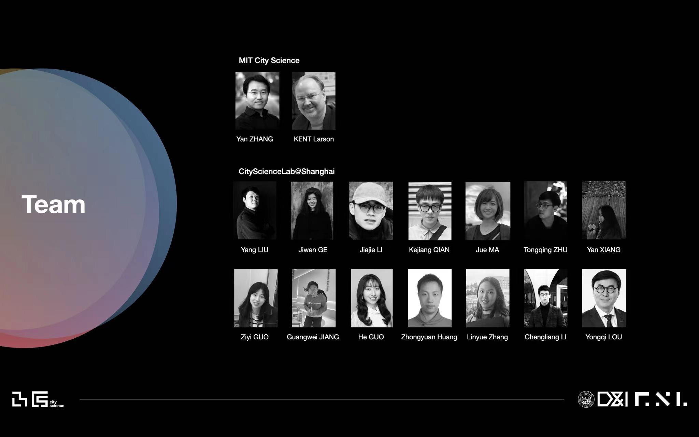

# SoCity Community Action:A New Process for Pro-social Urban Development

## Intro

Main codebase for CityScienceLab@Shanghai's CSS 2022 workshop Community DAO. Developed by 'Chance' Jiajie Li and Guangwei Jiang.

SoCity is a non-profit decentralized autonomous organization (DAO) that aims to establish an ecosystem that promotes prosocial pro-sustainability behaviors in cities with decentralized incentive policies.The core of the SoCity ecosystem is to quantify each individual or organization's social or sustainable value contribution according to their behavior, monetize and recognize the contribution, and then reward the users to further incentivize the positive feedback loop.

## Research Team

